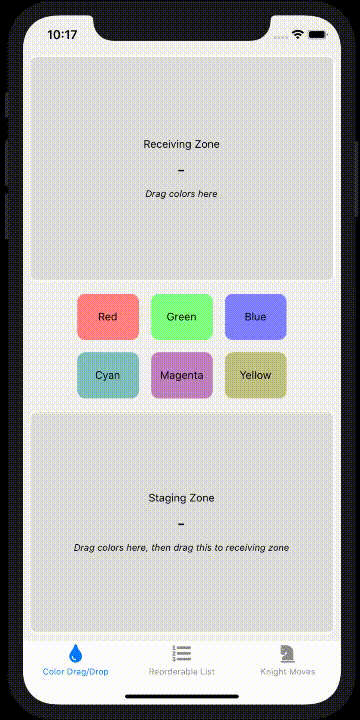
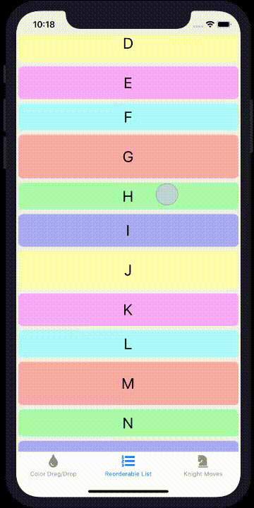
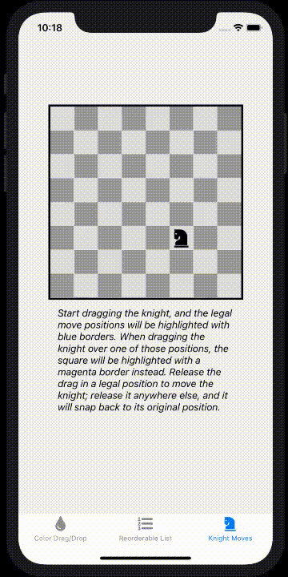
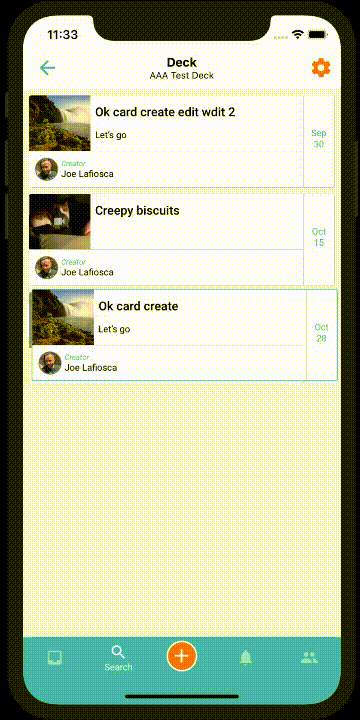

# react-native-drax

**A drag-and-drop system for React Native**

*"Not to be confused with react-native-picksaw"*

[](https://badge.fury.io/js/react-native-drax)
[](CODE-OF-CONDUCT.md)

## Overview

Drax is a declarative drag-and-drop system for React Native, written in TypeScript. It is designed to be flexible and powerful with the goal of supporting many use cases, while its stock components and default settings should cover the most common scenarios with minimal configuration.

**Note: as of version 0.10.0, React Native 0.65 or higher is required. For RN 0.62-0.64 projects, you may be able to use 0.9.3, but it will no longer be supported. For RN 0.61 projects, you may be able to use 0.6.0, but it will no longer be supported.**

*Personal note from Joe: this project is in need of additional [contributors/shepherds](#contributing). I have not been focused on React Native over the past year, and the state of the library has fallen behind the times. At a minimum, it should be updated to use the latest RNGH and take advantage of any fixes and new features in that and RN. I apologize that I do not have the availability to maintain this project to my own high standards and thank everyone who has been understanding of that.*

#### Contents

* [Screenshots](#screenshots)
* [Status](#status)
* [Background](#background)
* [Concept](#concept)
* [Installation](#installation)
* [Usage](#usage)
* [Caveats](#caveats)
* [Examples](#examples)
* [Contributing](#contributing)
* [Code of Conduct](#code-of-conduct)
* [License](#license)
* [Acknowledgments](#acknowledgments)

<a name="screenshots"></a>
## Screenshots

<a href="docs/images/color-drag-drop.gif"></a>
<a href="docs/images/reorderable-list.gif"></a>
<a href="docs/images/knight-moves.gif"></a>
<a href="docs/images/deck-cards.gif"></a>

(Click images to see larger versions.)

<a name="status"></a>
## Status

This library adheres to [Semantic Versioning (semver)](https://semver.org/) and is in its [0.y.z initial development phase](https://semver.org/#how-should-i-deal-with-revisions-in-the-0yz-initial-development-phase). It has been released so that early adopters (such as the project author) can begin to use it in production and identify gaps in the functionality. The API is subject to potentially significant rework until version 1.0.0 is released, and any minor version increment before then may include breaking changes. Documentation and full examples are still being written.

The author of this library has not had significant availability to work on it for quite a while now, due to higher priority life and work concerns. Newer versions of Drax's major dependencies have been released in that time, and many people have opened issues asking questions about usage and potential features. Relatively small fixes and easy questions are handled reasonably often, but ultimately another round of research, testing, and architecture are what would take this library to the next level of usability. It is not clear when that might happen, but [contributors are welcome](#contributing).

<a name="background"></a>
## Background

To give an idea of the problem this library is trying to solve, here is some informal background:

> In our React Native application we had a screen which showed a
> FlatList of cards that could be scrolled through or individually
> tapped to view details. We wanted to add the ability for a user
> to long-press a card then drag it into a different position in
> the list; in other words, we needed a reorderable list.
>
> I figured there must already be a library out there that would
> suit our needs. I tried out a few different packages, which each
> looked to have pros and cons, but nothing quite worked right how
> we expected. To complicate things further, our application used
> `react-navigation`, which seemed to conflict with some of them.
>
> We also had future features on our roadmap which would necessitate
> a more generic drag-and-drop solution. I found it a bit odd that,
> although reorderable lists and drag-and-drop have much functional
> overlap, there didn't seem to be a package for React Native which
> did both. It looked like React for the web was a little more mature
> in this arena, but that didn't help us. I asked some other
> developers if they knew of a solid React Native library for this,
> but they agreed that it was a gap in the ecosystem.
>
> I decided to create my own drag-and-drop library, including
> stock components for common behaviors. The goal, first and
> foremost, was to fulfill our draggable reorderable list wish.
> But beyond that, I wanted a robust foundation that could be
> used to flexibly implement various drag-and-drop-related
> solutions. I am sure that there are scenarios I have not
> yet considered, and I am open to input from other people
> who are working in this space.

<a name="concept"></a>
## Concept

Descriptions of the library's approach, underlying implementation, and drag-and-drop event lifecycle can be found in the [Concept Document](docs/concept.md).

<a name="installation"></a>
## Installation

First you must have a project using `react-native` version `>=0.62`, including `react-native-gesture-handler` version `>=1.8.0`. For further information on installing the latter, see [that library's documentation](https://software-mansion.github.io/react-native-gesture-handler/docs/getting-started.html).

Then simply install Drax with:

`yarn add react-native-drax`

or

`npm install react-native-drax`

There is no Cocoapods or native linking step here. You've already covered those needs with `react-native-gesture-handler`.

<a name="usage"></a>
## Usage

### Basic Usage

Import the library components:

```ts
import { DraxProvider, DraxView } from 'react-native-drax';
```

Wrap the area of your app that will use Drax with a `DraxProvider`, and create a couple `DraxView`s, one draggable and one receptive:

```tsx
<DraxProvider>
    <View style={styles.container}>
        <DraxView
            style={styles.draggable}
            onDragStart={() => {
                console.log('start drag');
            }}
            payload="world"
        />
        <DraxView
            style={styles.receiver}
            onReceiveDragEnter={({ dragged: { payload } }) => {
                console.log(`hello ${payload}`);
            }}
            onReceiveDragExit={({ dragged: { payload } }) => {
                console.log(`goodbye ${payload}`);
            }}
            onReceiveDragDrop={({ dragged: { payload } }) => {
                console.log(`received ${payload}`);
            }}
        />
    </View>
</DraxProvider>
```

The styles are provided here for completeness:

```ts
const styles = StyleSheet.create({
    container: {
        flex: 1,
        justifyContent: 'center',
        alignItems: 'center',
    },
    draggable: {
        width: 100,
        height: 100,
        backgroundColor: 'blue',
    },
    receiver: {
        width: 100,
        height: 100,
        backgroundColor: 'green',
    },
});
```

This will give you a blue box which can be dragged around and a green box which it can be dragged into. Watch the console log messages while you drag the blue box around, releasing the drag either in or out of the green box.

### API

*Full API description coming soon*

<a name="caveats"></a>
## Caveats

This library has several [known issues and limitations](https://github.com/nuclearpasta/react-native-drax/issues?q=is%3Aissue+is%3Aopen+label%3Areproduced), particularly around the [Android](https://github.com/nuclearpasta/react-native-drax/issues?q=is%3Aissue+is%3Aopen+label%3Aandroid) platform. We hope to address these and improve the library over time. For most use cases, the current functionality is probably fine.

This library currently expects React Native >=0.62 and React Native Gesture Handler >=1.8. Due to complexity, we cannot support the use of the library with older versions.

<a name="examples"></a>
## Examples

A reference application can be found at [`react-native-drax-example`](https://github.com/nuclearpasta/react-native-drax-example) demonstrating several use cases.

If you don't want to download and run the sample application, here are two Snack examples:

- [Basic drag-and-drop](https://snack.expo.io/@lafiosca/react-native-drax---basic-drag-and-drop?platform=ios)
- [Basic reorderable list](https://snack.expo.io/@lafiosca/react-native-drax---basic-reorderable-list?platform=ios)

Note: these Snack examples will not work in the Web device. You must use an iOS (default) or Android device.

<a name="contributing"></a>
## Contributing

Issues, pull request, and discussion are all welcome. See the [Contribution Guidelines](CONTRIBUTING.md) for details, and please reach out to [the author](https://github.com/lafiosca) if you would like to participate more significantly.

<a name="code-of-conduct"></a>
## Code of Conduct

Please note that this project is released with a [Contributor Code of Conduct](CODE-OF-CONDUCT.md). By participating in this project you agree to abide by its terms.

<a name="license"></a>
## License

This software library is licensed under the [MIT License](LICENSE.md).

<a name="acknowledgements"></a>
## Acknowledgments

The initial version of this library was written by [Joe Lafiosca](https://github.com/lafiosca) over the course of December 2019. Joe would like to give thanks to Nuclear Pasta co-founder Mark Thomas for being patient with the development process. Joe would also like to give thanks to Lena Raine, Tom Jenkinson, Rollie Pemberton, David Minnick, Tim Smith, and Danny Baranowsky for providing most of the coding background music that inspired this work.

Special thanks go to the folks who have contributed donations toward this project. (If you are a sponsor and would like your name listed here, please let me know! I do not want to make assumptions about people's privacy preferences.)
