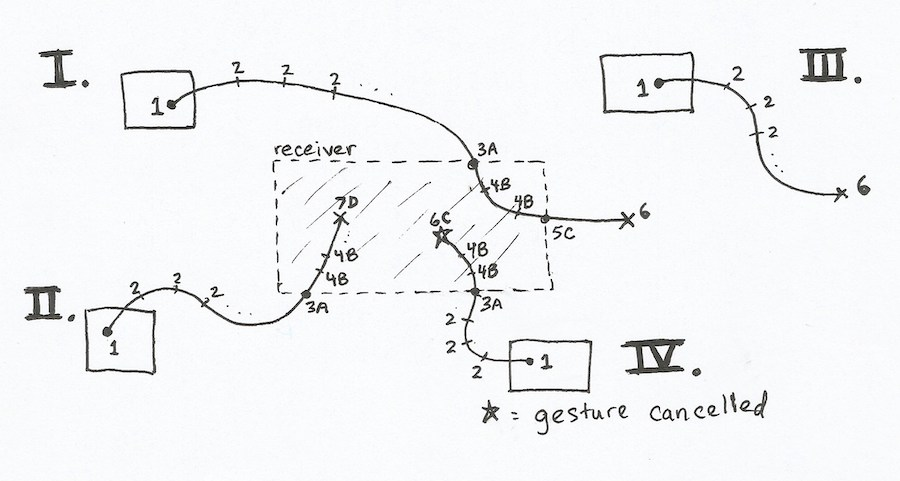

## Concept

The essential idea behind Drax is to augment the familiar React Native `View` component with attributes that enable it to be dragged around the screen, or to receive or monitor others that are dragged over it. These attributes include handlers for a wide variety of events in the drag-and-drop lifecycle, data payloads for dragging and receiving, and conditional styling and rendering based on drag status. This combination of features provides great flexibility and power via a declarative approach, with sensible default behaviors for simple use cases.

Drax consists of two fundamental components, `DraxProvider` and `DraxView`. The `DraxProvider` wraps the entire app (or at least the area of the app in which drag-and-drop behavior will occur). It provides the React context for all drag handling which each `DraxView` interfaces with. The `DraxView` is a view which can be dragged, can receive other drags, can monitor other drags, or any combination of those behaviors. The Drax library includes more complex components such as `DraxList` (a drag-reorderable `FlatList`), but they are implemented with `DraxView` internally.

## Implementation

Drax works by tracking the measurements of all `DraxViews` in relation to the `DraxProvider`, keeping an internal record of all their absolute screen positions and sizes. In the case of `DraxViews` nested inside of scrollable Drax components (e.g., `DraxList`), it does this by tracking their relationships to their parents as well as the parents' scroll offsets. Drax uses `react-native-gesture-handler` to determine when drags begin and end, converting the event data from that library into absolute screen coordinates to determine interactions between `DraxViews`.

*(More documentation on this, including diagrams, to come later.)*

## Drag-and-Drop Lifecycle

### Dragged Events

`DraxView` has an assortment of drag-and-drop lifecycle event handler attributes for draggable views:

1. `onDragStart`: when this view starts being dragged
2. `onDrag`: while this view is being dragged over no receiver
3. `onDragEnter`: when this view is dragged into a receiver
4. `onDragOver`: while this view is being dragged over a receiver
5. `onDragExit`: when this view is dragged out of a receiver
6. `onDragEnd`: when this view's drag ends outside of a receiver (or is cancelled)
7. `onDragDrop`: when this view's drag ends successfully over a receiver

### Receiver Events

`DraxView` also has set of drag-and-drop lifecycle event handler attributes for receptive views:

<ol type="A">
  <li><tt>onReceiveDragEnter</tt>: when a drag enters this view</li>
  <li><tt>onReceiveDragOver</tt>: while a drag is over this view</li>
  <li><tt>onReceiveDragExit</tt>: when a drag exits this view (or is cancelled)</li>
  <li><tt>onReceiveDragDrop</tt>: when a drag ends successfully over this view</li>
</ol>

### Drag and Receive Examples

The following image demonstrates examples of common drag-and-drop behavior:

**`Example I`** is described in detail as follows.

1: A `DraxView` configured as draggable is long-pressed to initiate a drag, yielding an `onDragStart (1)` event in itself.

2: The view is dragged to the right, yielding a series of `onDrag (2)` events.

3A: Then the drag crosses into another `DraxView` configured as receptive, which yields both an `onDragEnter (3)` in the dragged view and an `onReceiveDragEnter (A)` in the receiver.

4B: As the drag continues through the upper right corner of the receiving view, a series of `onDragOver (4)` events occur in the dragged view, simultaneously with a series of `onReceiverDragOver (B)` events in the receiver.

5C: The original view is then dragged out of the right side of the receiver, yielding an `onDragExit (5)` in the dragged view and an `onReceiveDragExit (C)` in the receiver.

6: Additional `onDrag (2)` events (not pictured) occur in the dragged view until it is finally released, yielding a single `onDragEnd (6)` in it.

**`Example II`** follows a similar progression to **`Example I`**, but the drag ends while still over the receiver, yielding an `onDragDrop (7)` in the dragged view and an `onReceiveDragDrop (D)` in the receiver.

**`Example III`** is a simple subset of **`Example I`** in which the drag never enters a receiver, so only the events in the dragged view occur.

**`Example IV`** is an exceptional case included for the sake of thoroughness. It is essentially the same as **`Example II`** but ends with the drag being cancelled by the gesture system for some reason. In this situation, no drop is considered to have happened. An `onDragEnd (6)` occurs in the dragged view, and an `onReceiveDragExit (C)` occurs in the receiver.

### Monitor Events

For more complex use cases, Drax has the concept of a monitoring `DraxView`. A monitor is similar to a receiver but has several important differences:

* A view is informed when it is dragged over a receiver by receiving specific events such as `onDragOver`, but it is not informed about monitors that it is dragged over.
* If multiple receivers overlap at the drag point, only the top-most receiver will receive drag events, but any number of overlapping monitors can simultaneously receive them.
* Monitors can receive additional events for drag start and end, which receivers do not. (This is to support the use case where a monitor fills the entire area underneath the other `DraxViews` so that drags can be tracked centrally.)

The monitor drag-and-drop lifecycle event handler attributes are:

* `onMonitorDragStart`: when a drag starts within this view
* `onMonitorDragEnter`: when a drag enters this view
* `onMonitorDragOver`: while a drag is over this view
* `onMonitorDragExit`: when a drag exits this view
* `onMonitorDragEnd`: when a drag ends outside of a receiver (or is cancelled) within this view
* `onMonitorDragDrop`: when a drag ends successfully over a receiver within this view
